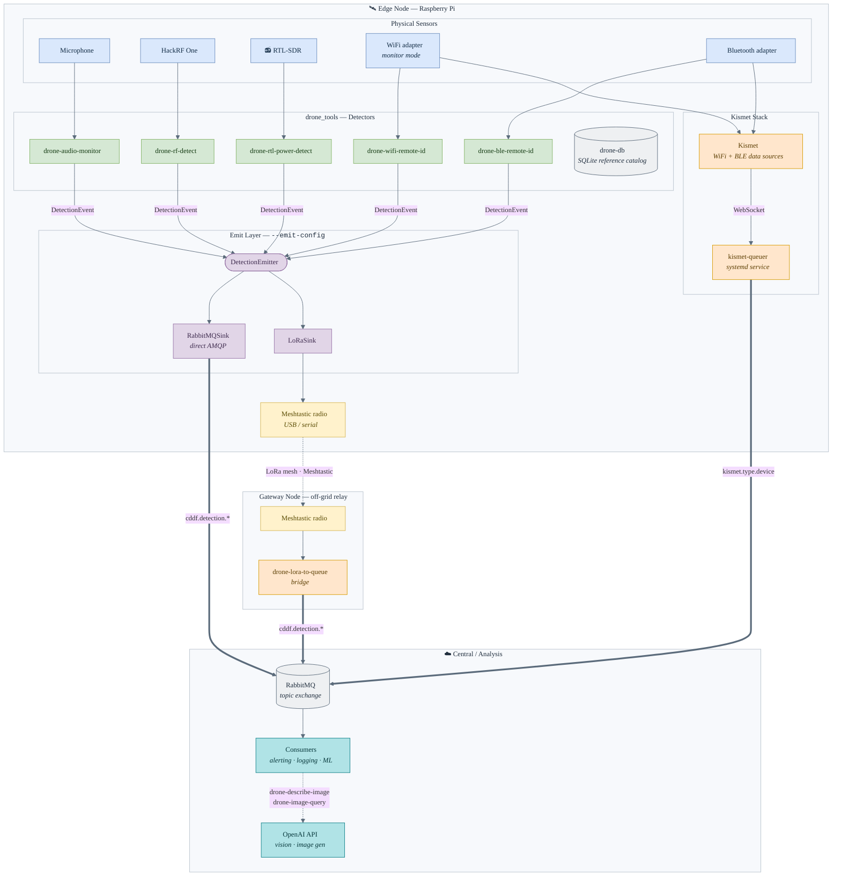

# CDDF — Citizen Drone Defense Force

A multi-modal drone detection and analysis toolkit for edge deployments. CDDF combines audio, RF, WiFi/BLE Remote ID, and vision-based detection into a unified sensor platform. Detections reach a central RabbitMQ exchange either directly over the network or relayed across a LoRa mesh for off-grid nodes, alongside Kismet sensor data.

## Architecture



> **Color key:** blue = sensors · green = detection software · purple = emit layer · amber = capture/queue bridges · yellow = LoRa radios · teal = central analysis. Solid bold arrows are AMQP publishes to RabbitMQ; the dashed arrow is the wireless LoRa mesh hop.

---

## Components

| Component | Description |
|-----------|-------------|
| **`drone_tools`** | Python package — audio, RF, WiFi Remote ID, vision detection modules, and drone reference database |
| **`kismet-queuer`** | Standalone service — bridges Kismet WebSocket API to RabbitMQ |
| **`ansible/`** | Ansible playbook for automated Watchtower edge node provisioning |
| **`install_edge_node.sh`** | Bash script for manual edge node provisioning |
| **`howto/`** | Hardware setup guides for nRF52 and Sniffle BLE integration |

---

## drone_tools

### Hardware Requirements

| Hardware | Used By | Notes |
|----------|---------|-------|
| HackRF One | `drone-rf-detect` | Broadband RF scanning |
| RTL-SDR dongle | `drone-rtl-power-detect`, `drone-rtl-power-visualize` | Requires `rtl_power` utility |
| WiFi adapter (monitor mode) | `drone-wifi-remote-id` | May require root/sudo |
| Bluetooth adapter | `drone-ble-remote-id` | Any adapter supported by `bleak` |
| Microphone / audio device | `drone-audio-monitor` | Any ALSA/PulseAudio device |
| OpenAI API key | `drone-image-query`, `drone-describe-image` | Set `OPENAI_API_KEY` env var |

### Installation

```bash
git clone https://github.com/h3ml0ck/cddf.git
cd cddf
pip install -e .
```

For development (includes linting and test dependencies):
```bash
pip install -e ".[dev]"
```

Set OpenAI API key for vision/image features:
```bash
export OPENAI_API_KEY="your_api_key_here"
```

### Usage

All tools are available as console scripts after `pip install -e .`:

**Audio detection**
```bash
# Detect drone sounds in an audio file (100–700 Hz analysis)
drone-audio-detect path/to/recording.wav --low 100 --high 700 --threshold 0.2

# Real-time microphone monitoring
drone-audio-monitor --device 0 --samplerate 16000
```

**RF detection**
```bash
# HackRF One — scan control frequencies
drone-rf-detect --freq 2.4e9 --freq 5.8e9 --remote-id-freq 2.433e9

# RTL-SDR — scan a frequency band
drone-rtl-power-detect --range 2400M:2483M:1M --threshold -30

# Visualize RTL-SDR scan output as a heatmap
drone-rtl-power-visualize rtl_power_data.csv -o spectrum_plot.png
```

**WiFi Remote ID (ASTM F3411)**
```bash
# Capture Remote ID broadcasts
drone-wifi-remote-id wlan0

# For adapters with filter issues
drone-wifi-remote-id wlan0 --no-filter
```

**Vision analysis**
```bash
# Identify drone type from an image
drone-describe-image path/to/drone_image.jpg
drone-describe-image path/to/drone_image.jpg --model gpt-4o   # override the model

# Identify and emit a structured VISION detection to your configured sinks
drone-describe-image path/to/drone_image.jpg --emit-config emit.ini

# Generate a drone image from a text prompt
drone-image-query "a DJI Mavic flying over a forest"
drone-image-query --model dall-e-3 --size 1024x1024 --n 1 "a quadcopter at dusk"
```

**BLE Remote ID (ASTM F3411)**
```bash
# Capture BLE Remote ID advertisements
drone-ble-remote-id
drone-ble-remote-id --timeout 60
drone-ble-remote-id -v        # Verbose with raw hex
```

**Drone reference database**
```bash
# Initialize the database (~/.cddf/drones.db)
drone-db init

# Populate it with the bundled catalog of common drones
drone-db seed

# Or import your own catalog (JSON list of objects, or CSV with a header row)
drone-db import my_drones.json
drone-db import my_drones.csv --replace   # update rows that already exist

# Add a drone to the catalog (--manufacturer-code is the CTA-2063-A Remote ID code)
drone-db add --manufacturer DJI --model "Mavic 3" --type quadcopter \
  --manufacturer-code 1581 \
  --remote-id-default --remote-id-wifi --remote-id-ble \
  --rf-frequency-mhz "2400,5800" --rf-protocol OcuSync --num-rotors 4

# Match a Remote ID serial to a catalog drone (manufacturer-code, then name)
drone-db identify 1581F4F2C8A1
drone-db identify 1581F4F2C8A1 --json

# List all drones (filter with --manufacturer, --type, --remote-id-only)
drone-db list
drone-db list --remote-id-only --json

# Search across all fields
drone-db search DJI

# Show details for a specific drone
drone-db show 1 --json

# Update or remove entries
drone-db update 1 --weight-g 895
drone-db remove 1 --force
```

Detectors can automatically enrich their detections with make/model from this
catalog: set `classify = true` (and optionally `classify_db`) in the `[emit]`
section of your `emit.ini`, and any detection carrying a Remote ID serial gets
its `manufacturer`/`model` filled in before being published.

**Testing / simulation**
```bash
# Simulate Sniffle BLE Remote ID output (no hardware required)
drone-mock-sniffle            # Run indefinitely
drone-mock-sniffle -t 30      # Run for 30 seconds
drone-mock-sniffle -v         # Verbose with decoded packets
```

Alternatively, run any module directly without installation:
```bash
python -m drone_tools.drone_audio_detection path/to/recording.wav
python -m drone_tools.drone_wifi_remote_id wlan0
```

Use `--help` with any command for full parameter reference.

### Detection Parameters

- **Audio**: 100–700 Hz band targets drone motor and rotor harmonics
- **RF**: 2.4 GHz and 5.8 GHz are the primary drone control link frequencies
- **WiFi Remote ID**: ASTM F3411 standard, WiFi OUI `0x903ae6`, beacon frames on monitor-mode interface
- **Thresholds**: All detection methods expose adjustable sensitivity via `--threshold`

### Running Tests

```bash
pytest                        # All tests
pytest -v                     # Verbose
pytest --cov=drone_tools      # With coverage
```

---

## kismet-queuer

Bridges a Kismet WebSocket feed to a RabbitMQ topic exchange. Runs as a systemd service with automatic reconnection and exponential backoff.

**Message routing key format:** `kismet.{message_type}.{device_type}`

### Setup

```bash
cd kismet-queuer
pip3 install -r src/requirements.txt

# Create config from template and edit credentials
cp config/config.ini.example config/config.ini
$EDITOR config/config.ini
```

> **Security:** The example config contains `CHANGE_ME` placeholders. You must set real RabbitMQ credentials before running. Create a dedicated RabbitMQ user:
> ```bash
> rabbitmqctl add_user cddf <strong-password>
> rabbitmqctl set_permissions cddf "kismet.*" "kismet.*" "kismet.*"
> ```

### Configuration

Key settings in `config/config.ini`:

| Section | Key | Description |
|---------|-----|-------------|
| `[kismet]` | `host`, `port` | Kismet server address (default: `localhost:2501`) |
| `[kismet]` | `api_key` | Preferred auth method (over username/password) |
| `[kismet]` | `use_tls` | Set `true` for `wss://` — recommended for remote hosts |
| `[rabbitmq]` | `host`, `port` | RabbitMQ broker address |
| `[rabbitmq]` | `username`, `password` | Must be changed from defaults |
| `[general]` | `reconnect_delay` | Base delay (seconds) for exponential backoff |
| `[general]` | `max_reconnect_attempts` | Max retries before giving up |

### Running

**Manually:**
```bash
python3 src/kismet_to_queue.py config/config.ini
```

**As a systemd service:**
```bash
sudo ./scripts/install_service.sh     # Install, enable, and start
sudo systemctl status kismet_to_queue
sudo journalctl -u kismet_to_queue -f
sudo ./scripts/uninstall_service.sh   # Remove
```

### Ansible Deployment

```bash
cd kismet-queuer/ansible
# Copy and edit inventory and credentials
cp inventory.example inventory
cp vars/credentials.yml.example vars/credentials.yml
$EDITOR vars/credentials.yml          # Use Ansible Vault in production

ansible-playbook playbook.yml -i inventory -u pi --become --ask-become-pass
```

---

## Edge Node Deployment (Watchtower Stack)

Full Raspberry Pi provisioning — installs Python dependencies, RTL-SDR/HackRF drivers, and Kismet with data sources.

**Ansible (recommended):**
```bash
cd ansible

# First-time setup: copy the example inventory and edit hosts
cp inventory.ini.example inventory.ini

# Test connectivity
ansible all -i inventory.ini -m ping

# Provision all nodes
ansible-playbook edge-node-watchtower-playbook.yml -i inventory.ini --ask-become-pass

# Provision a single node
ansible-playbook edge-node-watchtower-playbook.yml -i inventory.ini \
  --limit cddf-watchtower-a.local --ask-become-pass
```

**Manual (single node):**
```bash
bash install_edge_node.sh
```

Target OS: Raspberry Pi OS (Debian Bookworm/Trixie), default user `pi`.

---

## Hardware Setup Guides

Step-by-step guides are in the `howto/` directory:

- [`nrf-drone-remote-id-setup.md`](howto/nrf-drone-remote-id-setup.md) — nRF52840 DK/Dongle for BLE Remote ID scanning
- [`sniffle-drone-remote-id-setup.md`](howto/sniffle-drone-remote-id-setup.md) — Sniffle BLE sniffer firmware and usage
- [`sniffle-kismet-integration-setup.md`](howto/sniffle-kismet-integration-setup.md) — Integrating Sniffle with Kismet for Remote ID capture
